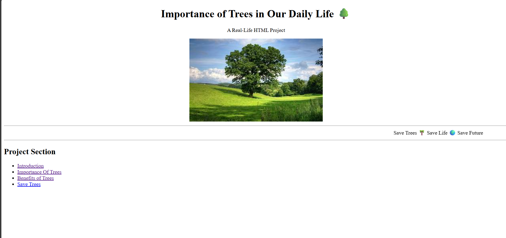

# 
Importance of Trees in Our Daily Life 🌳

###
🌳Trees are one of the most important parts of nature. They play a vital role in maintaining life on Earth. Without trees, life would not be possible. They provide oxygen, food, shelter, medicine, and many other benefits.🌳

##
***Home Page***

###
🌬️ 1. Trees Provide Oxygen
Trees absorb carbon dioxide (CO₂) and release oxygen (O₂) through the prthesis. Oxygen is essential for human and animal survival

</body>
</html>